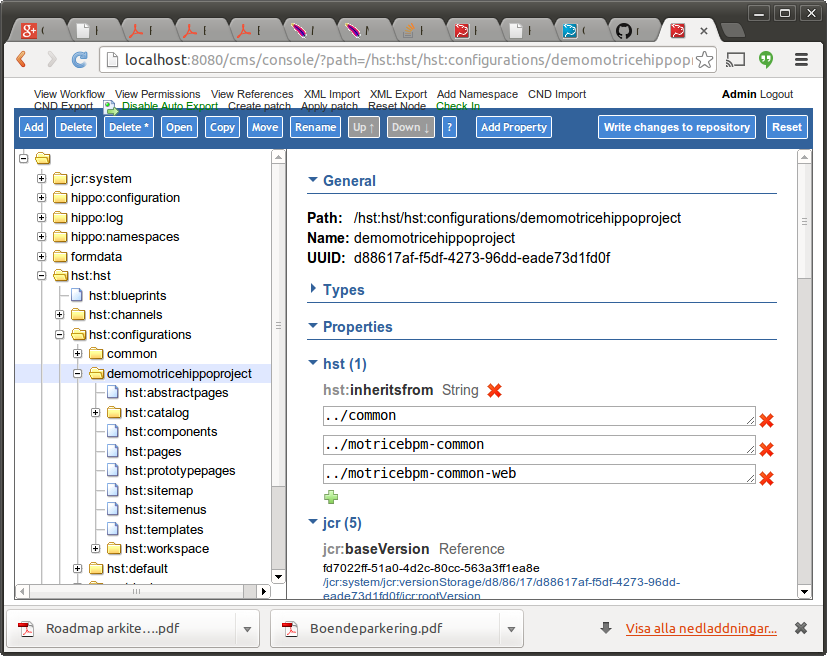

Motrice BPM Plugin - motricebpmplugin
================
This HippoCMS plugin enables BPMN2 process aware e-services with the Motrice BPM platform

## Prerequirements ##

### Motrice BPM ###

 * A Hippo project. If You do not already have a project, create a [new Hippo project](http://www.onehippo.org/trails/getting-started/creating-a-project.html). 
 * Basic Motrice configuration i.e. a database and motrice.properties TODO Link to wiki.motrice.se


## Install the Motrcie BPM Plugin ##

### Clone this repository and build it ###

TODO: Later on we will make the modules avaliable at a public maven repository. (the build step will be obsolete)

First build motrice TODO link to wiki.motrice.se

Build the plugin project at your local machine in order to make the maven modules avaliable. 
```
git clone https://github.com/motrice/motricebpmplugin.git
cd motricebpmplugin
mvn clean install
```

### Add motrice version property ###
Add the motricebpm.version property to Your Hippo Project's pom.xml properties section.
```xml
<motricebpm.version>0.1.0-SNAPSHOT</motricebpm.version>
```

### Add content bootstrap ###
Add the Motrice BPM content bootstrap dependency to your Hippo project's cms/pom.xml dependencies section.
```xml
    <dependency>
      <groupId>org.motrice.bpm</groupId>
      <artifactId>motricebpmplugin-bootstrap-configuration</artifactId>
      <version>${motricebpm.version}</version>
    </dependency>
```
It will create the basic Motrice BMP configuration on content repository bootstrap.

### Add site plugin ###

Add Motrice BPM dependency to your Hippo project's site/pom.xml dependencies section.
```xml
    <dependency>
      <groupId>org.motrice.bpm</groupId>
      <artifactId>motricebpmplugin-site</artifactId>
      <version>${motricebpm.version}</version>
      <type>war</type>
    </dependency>
```
Add Motrice BPM spring configuration to you Hippo project's site/src/main/webapp/WEB-INF/web.xml, the actual applicationContext.xml is imported by maven dependencies to motrice libraries.

```xml
<!--  motrice spring config -->
  <context-param>
    <param-name>contextConfigLocation</param-name>
    <param-value>classpath:applicationContext.xml</param-value>
  </context-param>
  
  <listener>
    <listener-class>org.springframework.web.context.ContextLoaderListener</listener-class>
  </listener>
  
  <!-- end of spring config -->
```
Compile and start the Hippo Site
```
mvn clean install
mvn -P cargo.run
```
Add motrice plugin to Your project's hst:configuration in Hippo CMS Console. 
See sample below 


